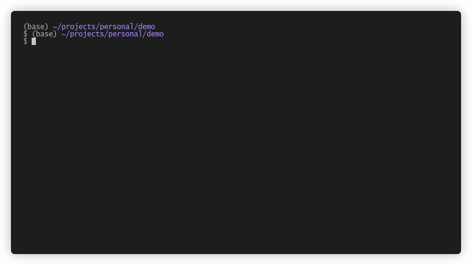

# cargo-fixie

Rust compiler errors are trying to help. Fixie makes them easier to read.
Internally calls `cargo build --message-format=JSON` and parses the JSON output.

### Sales pitch

Do your Rust compiler errors arrive as an angry wall of text?

Do you scroll... and scroll... and somehow end up reading errors from
a previous build?

Fixie is a small, friendly Cargo subcommand that helps you read Rust
errors one at a time, from first to last.

No scrolling archaeology needed.

This may already exist, but I couldn't find anything.

### Example



### Installation

```bash
git clone https://github.com/aylz83/cargo-fixie
cd cargo-fixie && cargo install --path .
```

### Usage

```bash
cd your_amazing_project
cargo fixie # or cargo fixie --ignore-warnings
```

Use Vim keys or arrow keys to cycle through errors. r to rebuild. i to toggle hiding warnings. q to quit.

### Plans

Fixie is small, but has (also small) dreams.

- [ ] Finish this README
- [ ] Don't take up whole terminal window.
- [X] Cleaner terminal upon exit.
- [X] Summary of warning and error count.
- [X] Live ignore warnings toggle.
- [X] Live rebuild option.
- [ ] Remember configuration
- [ ] Per project configuration (.fixie.toml or something)
